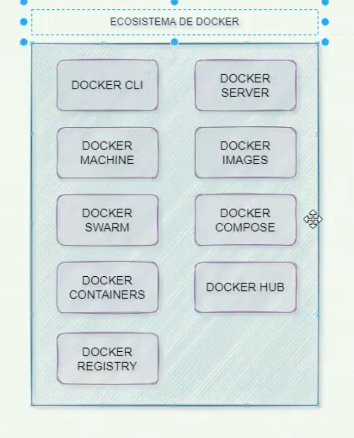
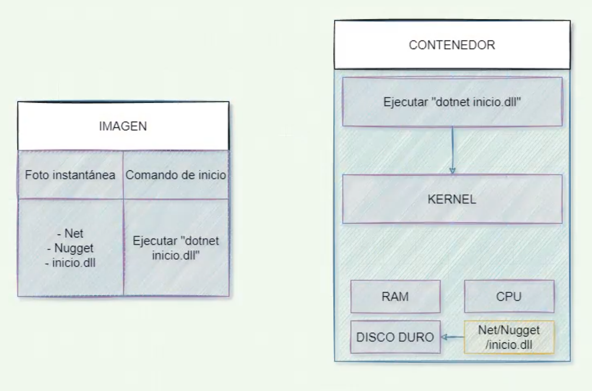
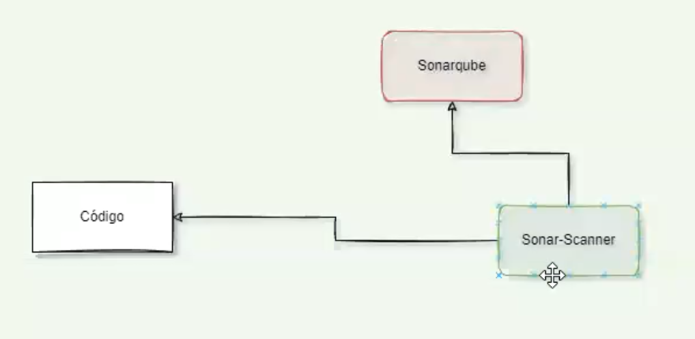
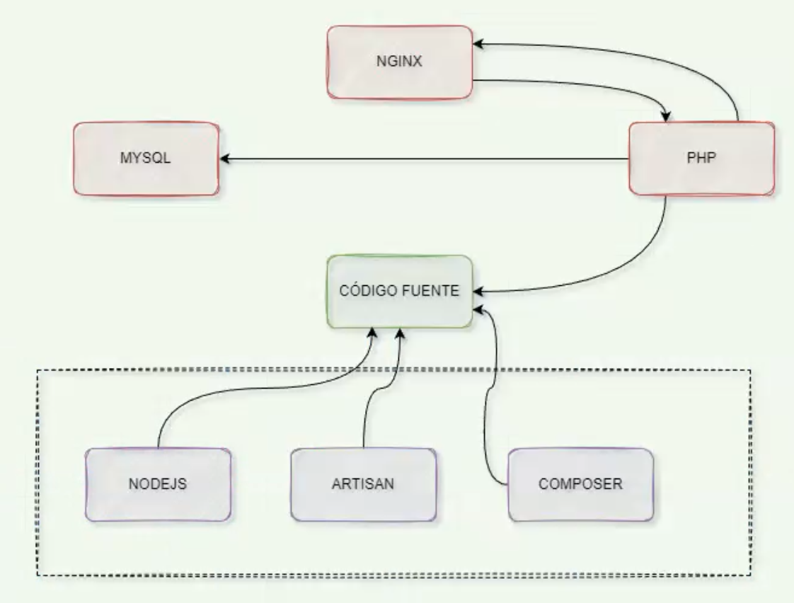
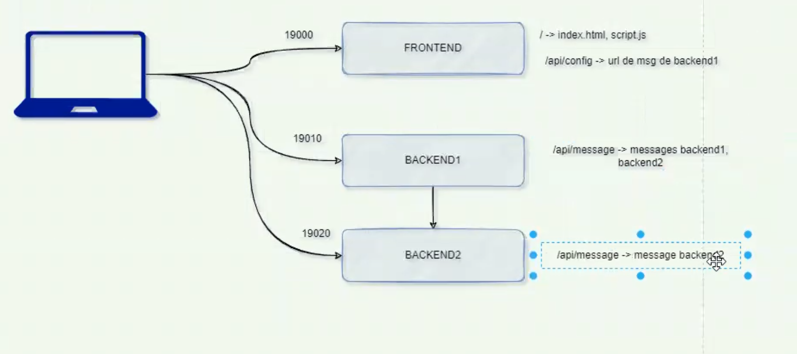

# Docker Pro

### 🔗 Link to review: [GitHub Repository](https://github.com/cursosdevfull/Docker_Kubernetes_Group07)

---

## Session 1

### 1️⃣ Docker Version

Displays the Docker version installed on your system.

```bash
docker --version
```

### 2️⃣ Docker Ecosystem

Docker is an ecosystem that creates and executes containers.



An image is a unique file containing all the programs, libraries, dependencies, and configuration needed to install or execute a set of programs.

Virtual machines always need resources, whether used or not, while containers use resources as needed.

This is how an image and container work:



### 3️⃣ List Images

```bash
docker images
docker image ls
```

### 4️⃣ Delete an Image

```bash
docker rmi <image name>
```

### 5️⃣ Download an Image

```bash
docker pull <image name>:<tag or version>
```

### 6️⃣ Filter a List

```bash
docker images | grep kafka
```

### 7️⃣ Inspect an Image

```bash
docker image inspect hello-world
```

---

## Containers

### 1️⃣ Create Container Without Executing

```bash
docker create --name <container name> <image name>:<tag or version>
```

### 2️⃣ List Running Containers

```bash
docker ps
docker ps | grep sonar
```

### 3️⃣ List All Containers

```bash
docker ps -a
```

### 4️⃣ Start a Container

```bash
docker start <container name>
```

### 5️⃣ Stop a Container

```bash
docker stop <container name>
```

### 6️⃣ Download Image, Create Container, and Execute

```bash
docker run --name <container name> <image name>:<tag/version>
```

### 7️⃣ Download Image, Create Container, and Execute in Detached Mode

```bash
docker run -d --name <container name> <image name>:<tag/version>
```

### 8️⃣ Delete Stopped Container

```bash
docker rm <container name or identifier>
```

### 9️⃣ Stop and Delete Running Container

```bash
docker stop <container name or identifier>
docker rm <container name or identifier>
docker rm -f <container name or identifier>
```

### 🔟 Mapping Ports

```bash
docker run -d --name <container name> -p <port host>:<port container> <image name>:<tag/version>
docker run -d --name <container name> -p <port host>:<port container> -p <port host>:<port container>... <image name>:<tag/version>
docker run -d --name nginx -p 3500:80 nginx:stable-alpine3.19-perl
```

---

## Session 2

### 1️⃣ Logs

```bash
docker logs <container name/identifier>
```

### 2️⃣ Execute a Command in Container

```bash
docker exec -i -t <container name> <program or script to execute>
docker exec -it <container name> sh
docker exec -i -t rbmq sh
```

### 3️⃣ Environment Variables


```bash
docker run -e <VAR_NAME>=<VAR_VALUE> nginx:alpine
docker run -d --name nginx -e USERNAME=dquispe -e USERROLE=admin nginx:alpine
```

### 4️⃣ Examples

```bash
docker run -d --name mysql -e MYSQL_ROOT_PASSWORD=12345 -e MYSQL_DATABASE=appdb -e MYSQL_USER=dquispe -e MYSQL_PASSWORD=12345 -p 3306:3306 mysql:8

docker run -d -p 27017:27017 --name mongo-server -e MONGO_INITDB_ROOT_USERNAME=admin -e MONGO_INITDB_ROOT_PASSWORD=12345 -v "/Users/dan/Courses/Docker y Kubernetes/docker-pro/volume/mongodb:/data/db" mongo:4.2-bionic
```

### 5️⃣ PostgreSQL

```bash
docker run -d --name postgres-server -p 5432:5432 -e POSTGRES_PASSWORD=12345 -e POSTGRES_USER=super -e POSTGRES_DB=test postgres:alpine3.16
```

### 6️⃣ MongoDB for Development

```bash
docker run -d -p 27017:27017 --name mongo-server -e MONGO_INITDB_ROOT_USERNAME=admin -e MONGO_INITDB_ROOT_PASSWORD=12345 mongo:4.2-bionic
```

### 7️⃣ SonarQube

```bash
docker run -d -p 9000:9000 -p 9092:9092 --name sonarqube-server sonarqube:8.9-community
```

### 8️⃣ RabbitMQ

```bash
docker run -d --name rabbitmq-server -p 15672:15672 -p 5672:5672 rabbitmq:3.9.22-management-alpine
```

---

## Volumes


Volumes are a way to manage persistent data that can be shared between containers or persist beyond the life of a container.

### 1️⃣ MongoDB Host Volume

```bash
docker run -d -p 27017:27017 --name mongo-server -e MONGO_INITDB_ROOT_USERNAME=admin -e MONGO_INITDB_ROOT_PASSWORD=12345 -v "/Users/dan/Courses/Docker y Kubernetes/docker-pro/volume/mongodb:/data/db" mongo:4.2-bionic
```

### 2️⃣ Nginx Host Volume

Nginx doesn't override the files on the host.

```bash
docker run -d --name nginx-server -p 8080:80 -v "/Users/dan/Courses/Docker y Kubernetes/docker-pro/volume/nginx/html:/usr/share/nginx/html" nginx:stable-alpine3.19-perl
```

### 3️⃣ Create Named Volume

```bash
docker volume create <vol-name>
docker volume create vol-html
```

### 4️⃣ List Named Volumes

```bash
docker volume ls
```

### 5️⃣ Apache Server with Named Volume

```bash
docker run -d --name apache-server -p 8090:80 -v vol-html:/usr/local/apache2/htdocs/ httpd:alpine
```

### 6️⃣ Apache Server with Anonymous Volume

```bash
docker run -d --name apache-server -p 8090:80 -v /usr/local/apache2/htdocs/ httpd:alpine
```

### 7️⃣ Inspect Volume

```bash
docker volume inspect <volume-name>
```

---

## Network


### 1️⃣ List Networks

```bash
docker network ls
```

### 2️⃣ Create a Bridge Network

```bash
docker network create <network name> -d bridge
```

### 3️⃣ Connect a Container to a Network

```bash
docker network connect <network-name> <container-name>
docker network connect red-test nginx-server
docker network connect red-test apache-server
```

### 4️⃣ Create a Container Connected to a Network

```bash
docker run -d --name apache-server -p 8090:80 --network red-test httpd:alpine
```

### 5️⃣ List Containers in a Network

```bash
docker network inspect <network-name>
```

---

## Session 3

### 1️⃣ SonarQube



```bash
docker run -d -p 9000:9000 -p 9092:9092 --name sonarqube-server sonarqube:community
```

### Sonar Scanner (Local)

```bash
sonnar-scanner -D"sonar.projectKey=example" -D"sonar.sources=." -D"sonar.host.url=http:localhost:9000" -D"sonar.login=<Token>"
```

### Sonar Scanner (Container)

```bash
docker run --rm -e SONAR_HOST_URL="http://localhost:9000" -e SONAR_LOGIN="<Token>" -v "${PWD}:/usr/src sonarsource/sonar-scanner/cli"
```

## Docker File

### Create image using Dockerfile file

```bash
docker build --tag <image name>:<version> .
docker build -t <image name>:<version> .
```

### Example of Dockerfile for apache server in Centos:7

```bash

FROM centos:7

RUN yum -y update

RUN yum -y install httpd

ENV connection = "user:password@mysql-server:3306"

COPY src /var/www/html


CMD ["apachectl", "-D", "FOREGROUND"]
```

### Create image using a plain text file

```bash
docker build -t <image name>:<version> -f <path to file>/<filename> <path to file>
```

```bash
docker build -t webapache:3.0 .
```

### Create image adding arguments

```bash
docker build -t <image name>:<version> . --build-arg <buil-arg>=<arg-value>
```

### Create node image adding environment variables

```bash
FROM node:alpine3.16

WORKDIR /app

ENV PORT=80

COPY src ./src

CMD ["node", "src/index.js"]
```

## Session 4

### Multistage nginx

```bash
# 1er Stage: Build
FROM node:lts-alpine as BUILD

WORKDIR /build

COPY app-sample/package.json .

RUN npm install

COPY app-sample .

RUN npm run build --prod


# 2do Stage: Runtime

FROM nginx:1.21.3-alpine

COPY --from=BUILD /build/dist/app-sample /usr/share/nginx/html

CMD ["nginx", "-g", "daemon off;"]
```

### Multistage node

```bash
# 1er Stage: Build
FROM node:lts-alpine as BUILD

WORKDIR /build

COPY package.json .

RUN npm install

COPY . .

RUN npm run build

# 2do Stage: Runtime

FROM node:lts-alpine

WORKDIR /app

COPY --from=BUILD /build/package.json .

COPY --from=BUILD /build/node_modules ./node_modules

COPY --from=BUILD /build/cache ./cache

CMD ["npm", "run", "start"]
```

### To remove stopped containers, networks without containeres, dangling images, dangling build cache

```bash
docker system prune
```

### To remove stopped containers, networks without containeres, images not connected to containers

```bash
docker system prune -a
```

### Docker Compose

### To execute all services

```bash
docker compose up
docker compose up -d
```

### To stop all services, delete containers and networks, no volumes

```bash
docker compose down
```

### To execute a docker compose file with different location and name

```bash
docker compose -f <path to yaml file> up -d
docker compose -f config/docker-wordpress.yaml up -d
```

### Creation of Laravel ecosystem with docker



#### To execute only one service

```bash
docker compose run --rm <service-name>
docker compose run --rm composer-service create-project --prefer-dist laravel/laravel .
```

#### To execute artisan

```bash
docker compose run --rm artisan-service migrate
```

#### To install a frontend library

```bash
docker compose run --rm nodejs-service install bootstrap
```

#### To re build the custom images

```bash
docker compose up -d --build
```

## Session 5

### Containers with node


